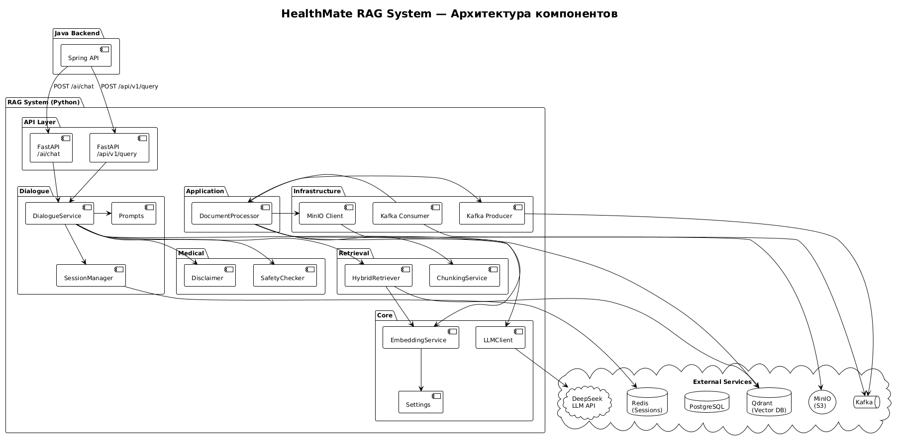
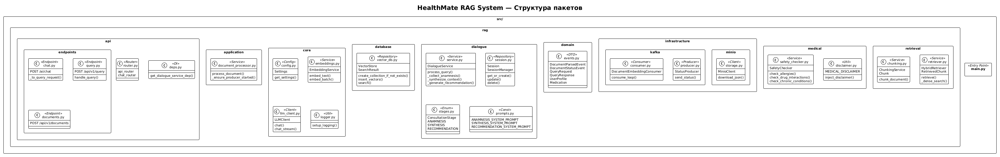
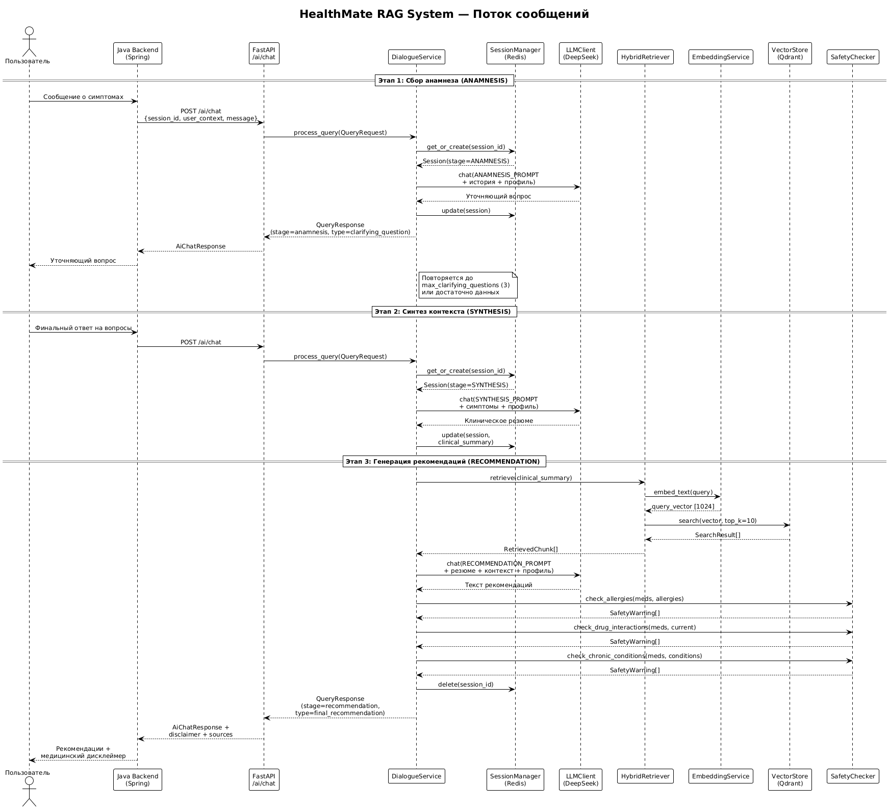
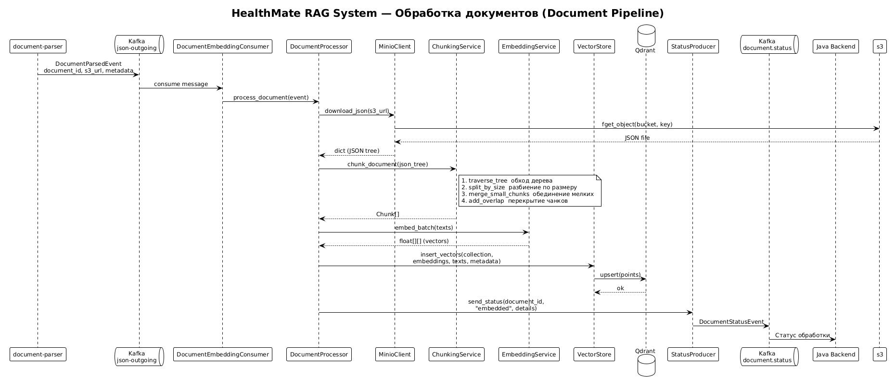

# HealthMate RAG System

Медицинская RAG-система (Retrieval-Augmented Generation) для платформы HealthMate.  
Принимает запросы от Java-бэкенда, проводит трёхэтапную консультацию и возвращает персонализированные медицинские рекомендации с учётом профиля пользователя.

---

## Архитектура

Сервис реализует два параллельных пайплайна, запускаемых в одном процессе:

| Пайплайн | Транспорт | Назначение |
|----------|-----------|------------|
| **HTTP API** (FastAPI / Uvicorn) | REST | Обработка запросов от Java-бэкенда (`POST /ai/chat`, `POST /api/v1/query`) |
| **Kafka Consumer** | Kafka topic `json-outgoing` | Приём событий от `document-parser`, chunking → embedding → сохранение в Qdrant |

### Внешние зависимости

| Компонент | Роль |
|-----------|------|
| **Qdrant** | Векторная БД — хранение и семантический поиск эмбеддингов чанков |
| **Redis** | Хранение сессий диалога (TTL-based) |
| **PostgreSQL** | Реляционное хранилище (Alembic-миграции) |
| **Kafka** | Асинхронный обмен событиями между сервисами |
| **MinIO (S3)** | Объектное хранилище распарсенных JSON-документов |
| **DeepSeek API** | LLM для генерации ответов (OpenAI-совместимый протокол) |
| **sentence-transformers** | Локальная модель `deepvk/USER-bge-m3` для генерации эмбеддингов (1024-мерных) |

### Диаграмма компонентов

> 

---

## Структура пакетов

```
src/
├── main.py                          # Entry point: FastAPI + Kafka consumer
└── rag/
    ├── api/                         # HTTP-слой
    │   ├── router.py                # Агрегатор роутеров
    │   ├── deps.py                  # Dependency Injection (FastAPI Depends)
    │   └── endpoints/
    │       ├── chat.py              # POST /ai/chat — интеграция с Java
    │       ├── query.py             # POST /api/v1/query — внутренний API
    │       └── documents.py         # POST /api/v1/documents
    │
    ├── application/                 # Прикладная логика
    │   └── document_processor.py    # Пайплайн: MinIO → Chunk → Embed → Qdrant
    │
    ├── core/                        # Ядро
    │   ├── config.py                # Pydantic Settings (env-конфигурация)
    │   ├── embeddings.py            # EmbeddingService (sentence-transformers)
    │   ├── llm_client.py            # LLMClient (DeepSeek / OpenAI-совместимый)
    │   └── logger.py                # structlog-конфигурация
    │
    ├── database/                    # Слой данных
    │   └── vector_db.py             # VectorStore — адаптер Qdrant
    │
    ├── dialogue/                    # Трёхэтапный диалог
    │   ├── service.py               # DialogueService — оркестратор консультации
    │   ├── session.py               # Session + SessionManager (Redis)
    │   ├── stages.py                # Enum: ANAMNESIS → SYNTHESIS → RECOMMENDATION
    │   └── prompts.py               # Системные промпты для каждого этапа
    │
    ├── domain/                      # Доменные модели (Pydantic)
    │   └── events.py                # DTO: QueryRequest, QueryResponse, Events
    │
    ├── infrastructure/              # Внешние адаптеры
    │   ├── kafka/
    │   │   ├── consumer.py          # DocumentEmbeddingConsumer
    │   │   └── producer.py          # StatusProducer
    │   └── minio/
    │       └── storage.py           # MinioClient — скачивание JSON
    │
    ├── medical/                     # Медицинская логика
    │   ├── safety_checker.py        # Проверка аллергий, взаимодействий, противопоказаний
    │   ├── disclaimer.py            # Медицинский дисклеймер
    │   └── profile_client.py        # Клиент профиля пользователя
    │
    └── retrieval/                   # Поиск и индексация
        ├── chunking.py              # ChunkingService — разбиение документов на чанки
        ├── retriever.py             # HybridRetriever — dense + BM25 (RRF)
        └── reranker.py              # Reranker (TODO)
```

> 

---

## Поток сообщений

### 1. Консультация пользователя (Chat Flow)

Трёхэтапный диалог между пользователем и системой:

**Этап 1 — Сбор анамнеза (ANAMNESIS)**

1. Java отправляет `POST /ai/chat` с сообщением пользователя и его профилем.
2. `DialogueService` создаёт или восстанавливает сессию из Redis.
3. LLM задаёт уточняющие вопросы (до `max_clarifying_questions = 3`).
4. Ответ возвращается Java-бэкенду → пользователю.

**Этап 2 — Синтез контекста (SYNTHESIS)**

5. После сбора достаточной информации LLM формирует клиническое резюме.
6. Резюме сохраняется в сессии (`clinical_summary`).

**Этап 3 — Генерация рекомендаций (RECOMMENDATION)**

7. `HybridRetriever` ищет релевантные чанки в Qdrant по клиническому резюме.
8. LLM генерирует персонализированные рекомендации на основе найденного контекста.
9. `SafetyChecker` проверяет рекомендации на аллергии, лекарственные взаимодействия и противопоказания.
10. Ответ дополняется медицинским дисклеймером и списком источников.
11. Сессия удаляется из Redis.

> 

### 2. Обработка документов (Document Pipeline)

Асинхронный пайплайн индексации медицинских документов:

1. `document-parser` публикует `DocumentParsedEvent` в Kafka-топик `json-outgoing`.
2. `DocumentEmbeddingConsumer` получает событие и передаёт в `DocumentProcessor`.
3. `MinioClient` скачивает JSON-дерево документа из MinIO.
4. `ChunkingService` разбивает дерево на чанки (traverse → split → merge → overlap).
5. `EmbeddingService` генерирует 1024-мерные векторы через модель `deepvk/USER-bge-m3`.
6. `VectorStore` сохраняет векторы с метаданными в коллекцию Qdrant.
7. `StatusProducer` публикует `DocumentStatusEvent` (`embedded` / `failed`) в Kafka-топик `document.status`.

> 

---

## Запуск

```bash
# Установка зависимостей
pip install -e ".[dev]"

# Переменные окружения
cp .env.example .env
# Заполнить DEEPSEEK_API_KEY и другие значения

# Запуск сервиса
python src/main.py

# Тесты
pytest --cov=src --cov-report=term-missing
```

## Тесты

- **130 тестов**, покрытие **94%**
- Фреймворк: `pytest` + `pytest-asyncio`
- Все внешние зависимости мокаются (Redis, Qdrant, Kafka, MinIO, LLM API)
